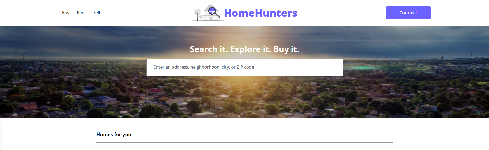
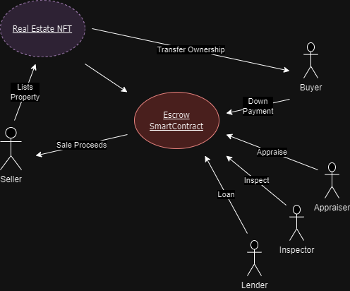

# HomeHunters

This project is a Zillow clone that functions as a real estate NFT DApp. It allows sellers to list properties, buyers to purchase properties using cryptocurrency, and various stakeholders to verify and approve transactions. The app utilizes Solidity for smart contract development, JavaScript (React & Testing) for frontend development, Hardhat as a development framework for smart contracts, and Ethers.js for blockchain interaction.

## Project Flow

1. **Seller Lists Property**: Sellers can list their properties on the platform.

2. **Buyer Deposits Earnest**: Buyers deposit an earnest amount to show interest in a property.

3. **Appraiser Appraises**: An appraiser assesses the property's value.

4. **Inspector Inspects**: An inspector inspects the property and approves if everything is satisfactory.

5. **Lender Funds Escrow**: A lender funds the escrow contract for the property.

6. **Ownership Transfer**: If all steps are completed successfully, the ownership of the NFT for the property is transferred to the buyer, and the seller receives payment.

## Technologies Used

- **Solidity**: Used for smart contract development.
- **JavaScript (React & Testing)**: Used for frontend development and testing.
- **Hardhat**: Used as a development framework for smart contracts.
- **Ethers.js**: Used for interacting with the blockchain.
- **React.js**: Used as the frontend framework.

## Requirements For Initial Setup
- Install [NodeJS](https://nodejs.org/en/)

## Setting Up
### 1. Clone/Download the Repository

### 2. Install Dependencies:
`$ npm install`

### 3. Run tests
`$ npx hardhat test`

### 4. Start Hardhat node
`$ npx hardhat node`

### 5. Run deployment script
In a separate terminal execute:
`$ npx hardhat run ./scripts/deploy.js --network localhost`

### 7. Start frontend
`$ npm run start`

Open your browser and navigate to `http://localhost:3000` to see the app running.

