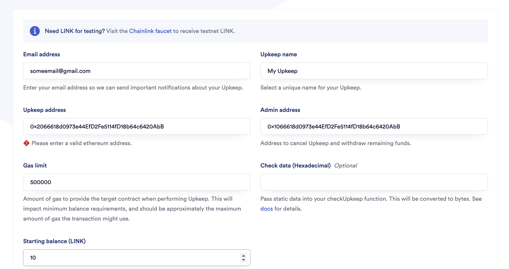

# Smart Contract Lottery

This is a lottery DApp. As you might know, there is no possibility to generate random numbers in a smart contract because of how the blockchain works. How can nodes agree on the truthfulness of an app if every node generates a different random number? To solve this problem, I integrated Chainlink VRF (Verifiable Random Function) into my smart contract.

To use Chainlink VRF in the lottery, we first deployed a Chainlink VRF contract on the Ethereum blockchain. This contract acts as the source of randomness for our lottery. When a user participates in the lottery, our lottery smart contract requests a random number from the Chainlink VRF contract. Chainlink's decentralized network of oracle nodes then collectively generate a random number using their cryptographic functions and deliver it back to our smart contract. This process ensures that the random number is both random and tamper-proof. Finally, we use this random number to determine the winner of the lottery, ensuring fairness and transparency in the selection process.

## Tests coverage


## How to run

```shell
make install
```

```shell
make test
```

```shell
make deploy # this will default to a local node
```

# Deployment to a testnet or mainnet

1. Setup environment variables

You'll want to set your `SEPOLIA_RPC_URL` and `PRIVATE_KEY` as environment variables. You can add them to a `.env` file, similar to what you see in `.env.example`.

- `PRIVATE_KEY`: The private key of your account (like from [metamask](https://metamask.io/)). **NOTE:** FOR DEVELOPMENT, PLEASE USE A KEY THAT DOESN'T HAVE ANY REAL FUNDS ASSOCIATED WITH IT.
  - You can [learn how to export it here](https://metamask.zendesk.com/hc/en-us/articles/360015289632-How-to-Export-an-Account-Private-Key).
- `SEPOLIA_RPC_URL`: This is url of the sepolia testnet node you're working with. You can get setup with one for free from [Alchemy](https://alchemy.com/?a=673c802981)

Optionally, add your `ETHERSCAN_API_KEY` if you want to verify your contract on [Etherscan](https://etherscan.io/).

1. Get testnet ETH

Head over to [faucets.chain.link](https://faucets.chain.link/) and get some testnet ETH. You should see the ETH show up in your metamask.

2. Deploy

```
make deploy ARGS="--network sepolia"
```

This will setup a ChainlinkVRF Subscription for you. If you already have one, update it in the `scripts/HelperConfig.s.sol` file. It will also automatically add your contract as a consumer.

3. Register a Chainlink Automation Upkeep

[You can follow the documentation if you get lost.](https://docs.chain.link/chainlink-automation/compatible-contracts)

Go to [automation.chain.link](https://automation.chain.link/new) and register a new upkeep. Choose `Custom logic` as your trigger mechanism for automation. Your UI will look something like this once completed:

